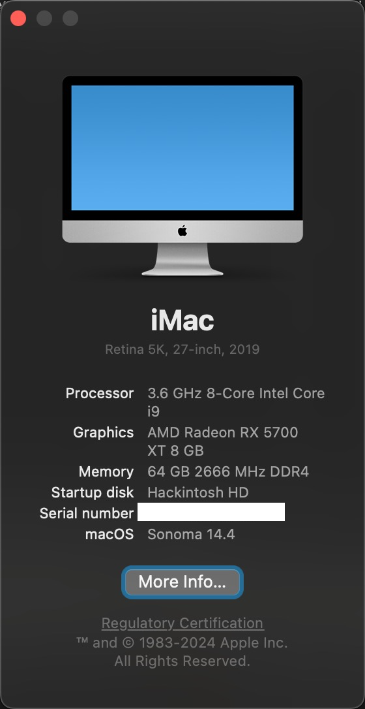
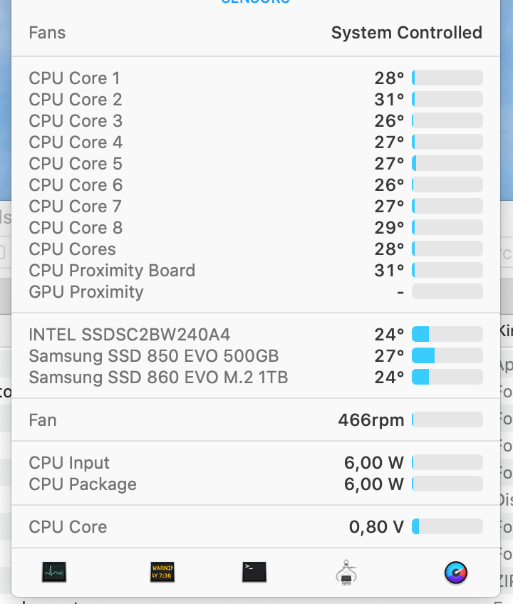
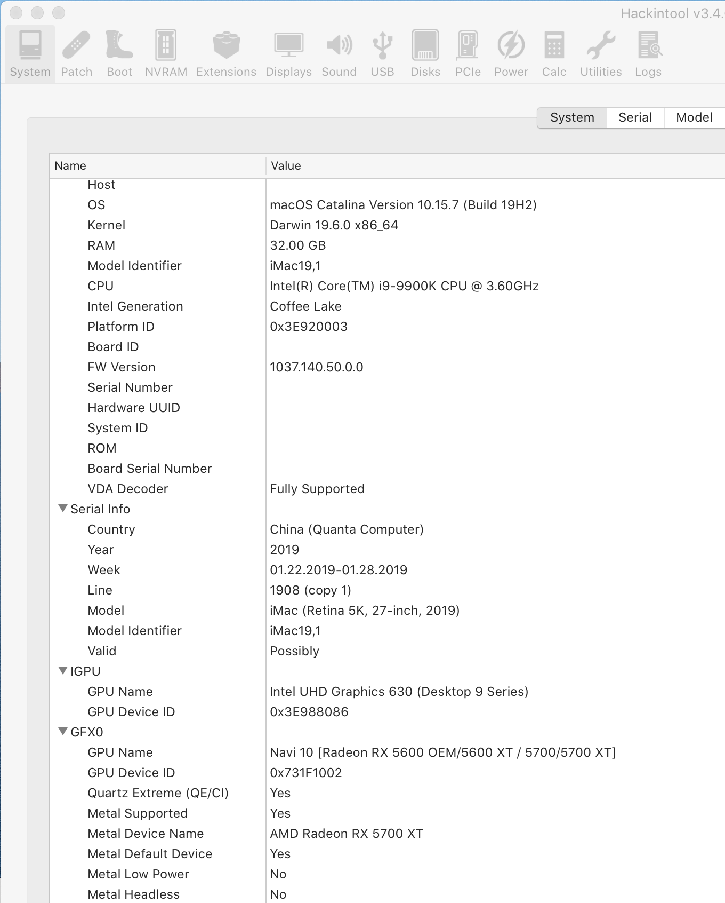
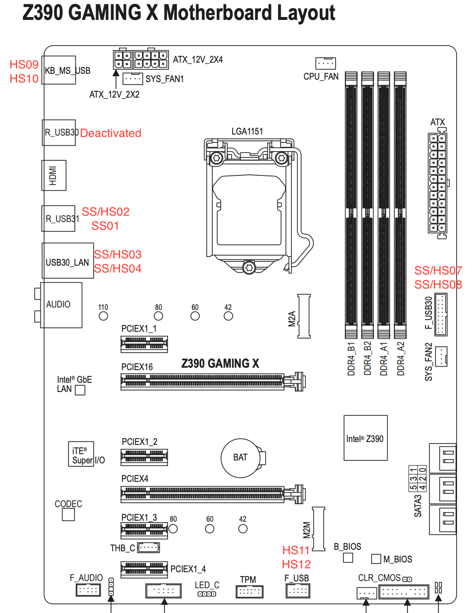

# Hackintosh Gigabyte GAMING X i9-9900k 5700XT

## Verified working with Monterey, Ventura, Sonoma




## Configuration
```
- Motherboard: Gigabyte Gaming X
- BIOS: f10h
- CPU: i9-9900K  
- RAM: 4x 8GB Crucial Ballistix Sport LT BLS2K8G4D30BESBK 3000 MHz, DDR4
- Storage: Samsung 970 EVO M.2 1TB  
- dGPU: ASUS 5700XT (Reference)  
- WIFI/BT: FV-T919  
- SMIBIOS 19,1
- OpenCore 0.9.9
```
## Confirmed working
```
- Quick boot into MacOS and rock solid
- NVRAM if CFG Lock is disabled
- Fan and CPU temp information (see below)
- iMessage,Handoff and Approve & Unlock with Apple Watch
- Sleep and Wake from bluetooth mouse or keyboard
- iGPU Framebuffer for hardware acceleration (encoding/decoding/preview) including Apple TV DRM movies (shikivga=80) and SideCar
(note: Big Sur seems to break the support for Apple TV+, Amazon Prime Video still works fine in Chrome)
```




- Improved OpenCL [here](https://browser.geekbench.com/v5/compute/1264374) and Metal performance [here](https://browser.geekbench.com/v5/compute/1264376) thanks to the Radeon optimisations

## Known Issues


## Bios Setup:
```
- Make sure the IGP is set to Enabled for the Framebuffer to be recognised (Auto will not work)
- Disable CFG Lock
- Disable Serial Port
- Advanced Mode > Settings > Above 4G Decoding > Enabled
- Advanced Mode > Settings > USB Configuration > XHCI Hand-off > Enabled
- Advanced Mode > Boot > CSM Support > Disabled
```

## USB Setup:

Some ports have been disabled to stay below the 15 port limit
Ignore the Thunderbolt controller, this has been removed from this EFI.




## Post Installation

1. Setup Bios as per above
2. Open your config.plist, go to PlatformInfo -> Generic and populate the Serial, Board Serial (MLB), SystemUUID and ROM (ethernet MAC address in Base64 [more info](https://dortania.github.io/OpenCore-Post-Install/universal/iservices.html#fixing-en0)). Make sure to edit the config.plist only with ProperTree.
3. Go to System Preferences > Startup Disk and select your startup disk.
4. [Enable Trim](https://www.howtogeek.com/222077/how-to-enable-trim-for-third-party-ssds-on-mac-os-x/).
5. Done.

If you get stuck at OpenCore boot, try to clear nvram via OpenCore settings  


## Tips
- Use [Hackintool](http://headsoft.com.au/download/mac/Hackintool.zip) to validate correct implementation of Framebuffer and USB
- Use [Macinfo](https://github.com/acidanthera/MacInfoPkg) to generate your S/N
